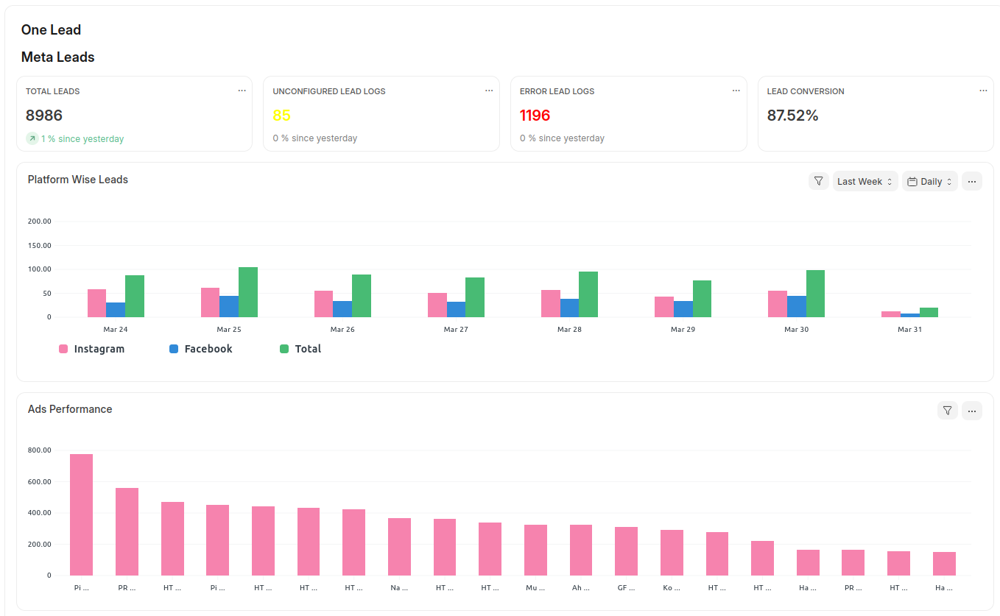

# OneLead - Lead Management Solution

OneLead is a **Frappe-based lead management system** designed to seamlessly integrate with multiple lead sources, including **Meta (Facebook) Leads** and **Google Leads**. It automates lead collection, processing, and assignment within your business workflow.

## Lead Sources

### 🔹 Meta Leads
OneLead integrates with **Meta (Facebook) Lead Ads**, allowing businesses to **automatically capture** leads from Facebook and Instagram ad campaigns, map them to internal CRM systems, and assign them to sales teams.

### 🔹 Google Leads
With OneLead's **Google Lead Integration**, you can fetch leads directly from **Google Ads Lead Form Extensions**, ensuring that every inquiry is instantly available in your CRM for follow-up.

## Features
- 🔄 **Automated lead fetching** from Meta & Google.
- 📌 **Custom mapping** to internal lead structures.
- 📊 **Lead tracking & assignment** based on business rules.
- 🔗 **Webhook-based integration** for real-time updates.

## Sneak Peek 👀

Here’s a quick look at the **OneLead Dashboard** — your central hub for managing and tracking leads from all sources.

!!! info "OneLead Dashboard Preview"
    

Proceed to **Meta Integration** for detailed setup instructions.
