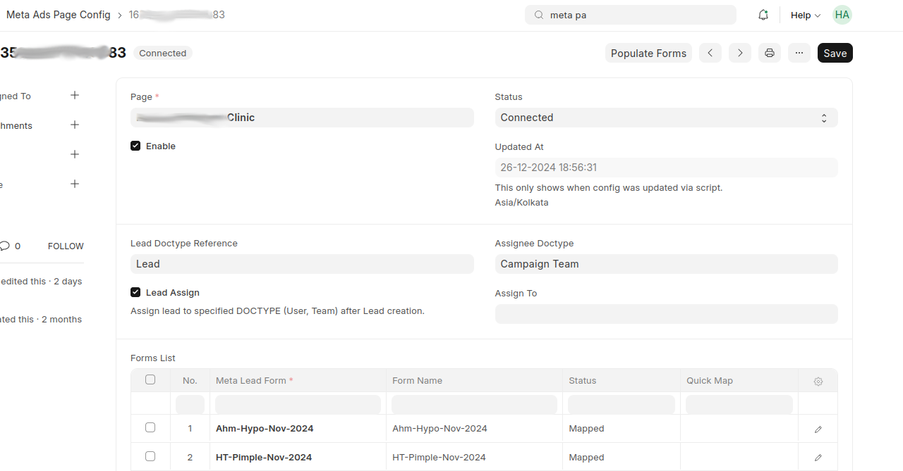
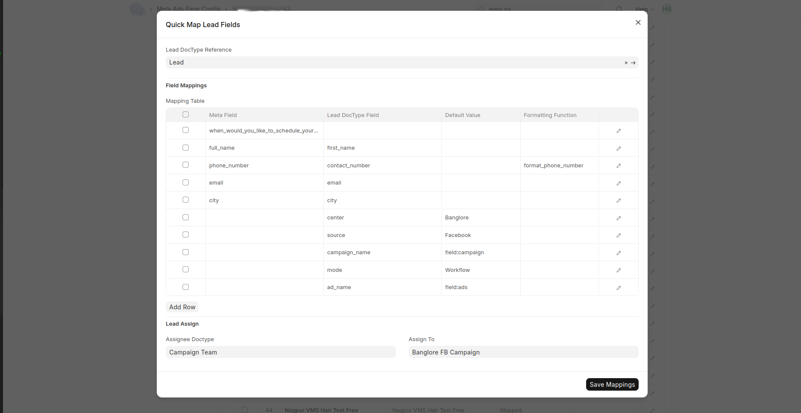

# **Meta Form Fetching & Mapping in OneLead**

Once your **Meta Ads Page Config** is set up and leads are being received in **Meta Webhook Lead Logs**, the next step is **fetching and mapping lead forms**. This ensures that incoming lead data is correctly assigned to your CRM lead doctype fields.

## **Page Configuration**
To find the **pages** associated with your Meta Ad Account:
- Navigate to **OneLead > Meta Ads Page Config**.
- This will display a **list of page names** linked to your **user_adaccounts**.
- Alternatively, check **OneLead > Meta Page** to see the **full list of fetched pages**.

**Meta Ads Page Config:**
!!! info "Meta Ads Page Config"
    

### **Verify Lead Doctype Reference**
- In **Meta Ads Page Config**, ensure that **"Lead Doctype Reference"** is set.
- This acts as a **global setting** to assign all lead forms under this page to a specific **Lead Doctype**.
- You can override this **per individual form** later.

Ensure that your page is enabled to allow lead entries. If disabled, it will appear as **disabled** in **Meta Webhook Lead Logs**.

---

### **Mapping Meta Lead Forms**
  1. **Open the Page Configuration** (Meta Ads Page Config).
  2. Under the **mapping child table**, add a new row and select a **Meta Lead Form** from the Forms List.
  3. Click the **Quick Map button** (**Note**: Due to a Frappe table issue, the button will not appear until you select a row).
  4. This will open the **Quick Map Lead Fields** pop-up.

**Forms List & Quick Map Button:**
!!! info "Quick Map"
      

---

## **Quick Map Lead Fields**
In the **Quick Map Lead Fields** pop-up, you will see:

| Column | Description |
|--------|------------|
| **Meta Field** | Fields available in the Meta Lead Form. |
| **Lead Doctype Field** | Fields from the selected **Lead Doctype Reference**. |
| **Default Value** | Hardcoded values for this field, applied to all leads under this form. |
| **Formatting Function** | Helper function to modify/sanitize the field value before saving. |
| **Function Parameters** | If a function requires additional parameters, pass them as a JSON object. |

---

### **Understanding Field Mapping Logic**
- **Meta Field → Lead Doctype Field Mapping**
    - Assign Meta form fields to corresponding CRM fields.
    - Ensure **mandatory fields** in the Lead Doctype are mapped correctly.

- **Default Value**
    - If a field is missing in Meta Lead Form, **you can hardcode a value**.

    - **Field Lookup Order (Dynamic Values)**
        If a default value field is mapped using **`field:field_name`**, OneLead searches for the field_name value in this order:
        1. **Meta Webhook Lead Logs**
        2. **Meta Lead Form**
        3. **Meta Ads Page Config**

        - If no value is found, an error is raised in **Meta Webhook Lead Logs**.

- **Formatting Function**
    - Choose a function to **modify data before storing** (e.g., phone number formatting).
    - Custom functions can be added via **Server Scripts** and handled in **Lead doctype event (`validate` or `before_save`)**.

- **Function Parameters**
    - column available in form view.
    - If a **custom function** requires parameters, pass them as a **JSON object**.

---

### **Saving & Populating Forms**
  - Once all fields are mapped, **click Save Mappings**.
  - Save the **Meta Ads Page Config**.

#### **Troubleshooting**
- If a **form is missing** in Meta Lead Form, click **Populate Forms** to fetch all latest forms for that page.

<!-- **Populate Forms Button:**
 -->

### **Next Steps**
- [Meta Webhook Lead Logs](meta_webhook_lead_logs.md)
- [Meta Lead Testing](meta_lead_testing.md)

This completes the **Meta Form Fetching & Mapping** setup for OneLead.
