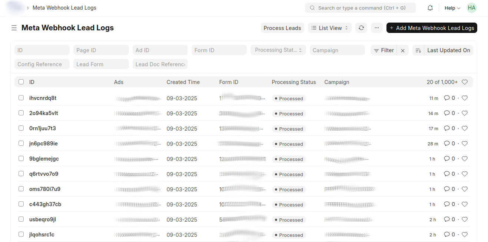
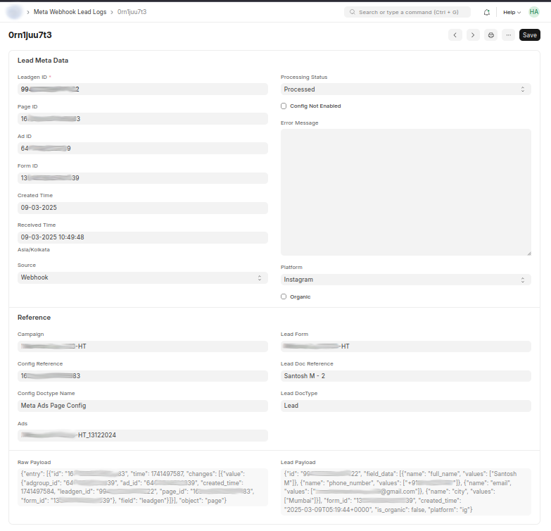
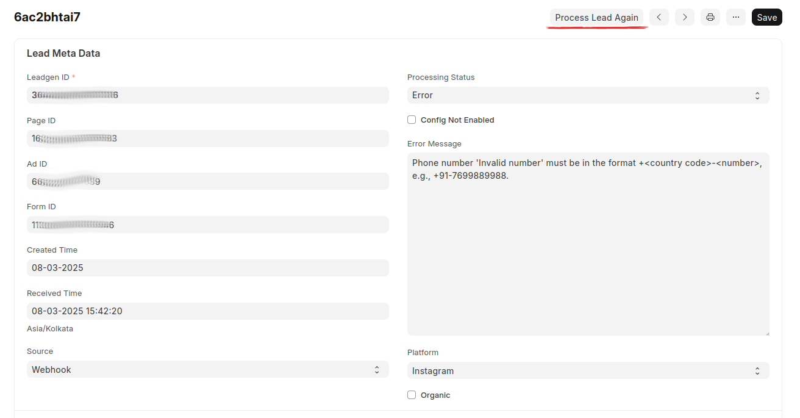
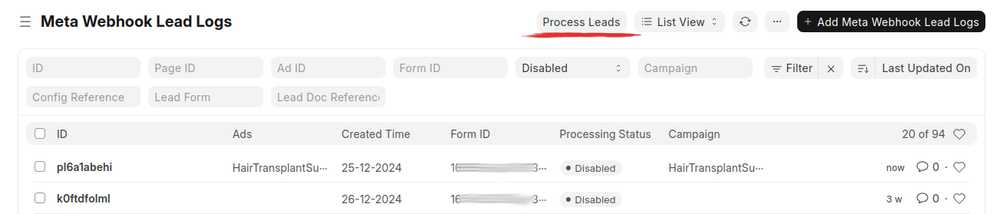

### **Meta Webhook Lead Logs in OneLead**

The **Meta Webhook Lead Logs** serve as the central logging system for all incoming leads from Meta (Facebook & Instagram). This ensures that no lead is lost, even if the system is not configured at the time of lead reception.

This section covers:

- **Field explanations**
- **Processing statuses**
- **Error handling**
- **Lead reprocessing**
- **Lead sources (Webhook, Import, Polling - Upcoming)**
- **Organic leads**
- **System robustness and lead loss prevention**

!!! info "Meta Webhook Lead Leads"
    

---

## **Lead Log Fields and Their Roles**
Each lead log entry contains multiple fields that provide details about the lead and its processing status.

### **Lead Metadata (Received from Meta)**
| **Field**         | **Description** |
|-------------------|---------------|
| **Leadgen ID**    | Unique ID assigned by Meta to identify the lead. |
| **Page ID**       | The Meta Page from which the lead was generated. |
| **Ad ID**         | The Ad associated with the lead (if available). |
| **Form ID**       | The Meta Lead Form ID used for lead collection. |
| **Created Time**  | The time when the lead was created on Meta’s platform. |
| **Received Time** | The time when OneLead received the lead from Meta. |

### **Processing & Configuration**
| **Field**            | **Description** |
|----------------------|---------------|
| **Source**          | How the lead was received (`Webhook`, `Import`, `Polling - Upcoming`). |
| **Platform**        | The platform where the lead was generated (Facebook, Instagram). |
| **Processing Status** | The status of the lead (`Pending`, `Processed`, `Error`, etc.). |
| **Config Reference**  | Links the lead to the **Meta Ads Page Config** used for processing. |
| **Lead Form**        | The name of the lead form used in Meta. |
| **Lead Doc Reference** | The mapped Lead Doctype in Frappe (if configured). |

### **Error Handling & Data**
| **Field**            | **Description** |
|----------------------|---------------|
| **Error Message**    | Describes any error that occurred during processing. |
| **Raw Payload**      | Stores the raw JSON data received from Meta in Webhook. |
| **Lead Payload**     | Stores lead data fetched from Meta based on `Leadgen ID`. |

!!! note "Example: Lead Log Detail"
    
---

## **Processing Statuses**
Each lead in the **Meta Webhook Lead Logs** can have one of the following statuses:

### **Pending**
- The lead has been received but has **not yet been processed**.
- This happens when a webhook is received, and the system has not yet executed the mapping and entry creation.

### **Unconfigured**
- The system **could not find the "Meta Ads Page Config"** for the **Page ID** in the webhook.
- OR, the **Page ID was found** but the **Form ID was not listed** under the **mapping child table**.
- **Solution:** Ensure that the page is configured, and the lead form is mapped.

### **Disabled**
- The system found the **Meta Ads Page Config**, but it is **not enabled**.
- Leads from this page will not be processed unless enabled.
- **Solution:** Go to **Meta Ads Page Config** and enable the configuration.

### **Processed**
- All requirements were met (configuration exists, mapping is correct).
- The lead was successfully **mapped and entered** into the Lead Doctype.
- The lead is now available for CRM use.

### **Error**
- An unexpected issue occurred, preventing lead entry.
- **Common Error Scenarios:**
    - **Invalid Contact Number:** The phone number does not follow the required format.
    - **Invalid Data Format:** For example, names containing special characters like `< >`.
    - **Missing Mandatory Fields:** The lead form may not contain all required fields.
    - **Unexpected Meta Response:** Sometimes, Meta sends partial or incorrect data sent from user.
- **Solution:**
  - Use **validation hooks** or **formatting functions** to fix data issues.
  - Manually correct data and mark as processed lead.
  - Mark unrecoverable leads as **Loss**. (TODO)

!!! danger "Example: Error Leads"
    

### **Loss (New Status)** (TODO)
- Some leads cannot be recovered, but they **do not qualify as an "Error"**.
- These leads will have **incorrect/incomplete data** that cannot be fixed by system logic.
- Example: **Invalid or missing contact details**.
- **Action:** Manually mark them as **"Loss"**, so they don’t appear as errors.

---

## **Reprocessing Leads**
If a lead is not in a **Pending** or **Processed** state, it can be reprocessed.

### **How to Reprocess Leads?**
#### **Process Lead Again (Individual)**
- Open a lead log entry.
- Click **"Process Lead Again"**.

#### **Bulk Reprocess**
- Select multiple lead logs in **List View**.
- Click **"Process Leads"** (Runs as a background job).

!!! info "Process Leads"
    

---

## **Lead Sources**
There are **three ways** a lead can be received in OneLead:

### **Webhook (Real-Time)**
- The most common and **recommended** method, can not be turned off.
- Leads are pushed from Meta when a user submits a form.

### **Import (Manual)**
- Leads can be **imported via the Import Tool**, requiring only six key details:
  - **Leadgen ID**
  - **Page ID**
  - **Ad ID**
  - **Form ID**
  - **Created Time**
  - **Received Time**
- Helpful for **historical data processing** or **bulk lead uploads**.
- In cases where your system was down or for some issue you it could not receive hooks you can import manually.

### **Polling (Upcoming Feature)**
- Will allow fetching leads **on Interval** from Meta.

---

## **Organic Leads**
- Leads that **do not originate from an ad** will have:
  - **No Ad ID**
  - **A platform value (Facebook or Instagram)**
- These are **non-paid leads**, often from **organic post interactions**.

---

## **System Robustness and Lead Loss Prevention**
OneLead is designed to **capture every lead received from Meta**, regardless of:
- Whether the **page is configured** or not.
- Whether the **page has been fetched** or not.
- Whether the **user token is valid** or expired.

**Meta Webhook Lead Logs will store everything received.**  
**Leads can be processed later after configuration is updated.**  
**No leads are lost, unless the system is completely down when Meta sends the webhook.**  

!!! warning "Lead Loss Scenario"
    The only case where a lead is lost is if OneLead is completely **unreachable** when Meta sends the webhook.

---

## **Best Practices for Error Handling**
- **Validate lead data before submission.**
- **Use helper functions** to format and clean data before processing.
- **Regularly check the error logs** and take corrective action.
- **Manually review and correct invalid leads** to ensure no opportunities are lost.

---

## **Next Steps**
- [Meta Lead Testing](meta_lead_testing.md)  
- [Troubleshooting](../troubleshooting/meta_webhook_issues.md)  

### **Still Facing Issues?**
Raise an issue on GitHub:  
[OneLead Issues](https://github.com/redsoftware-hq/onelead/issues)  
