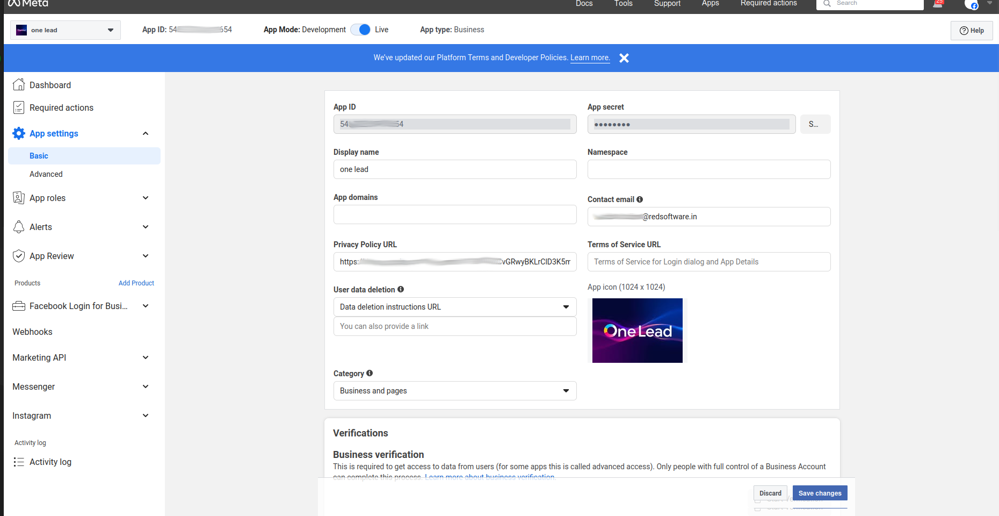
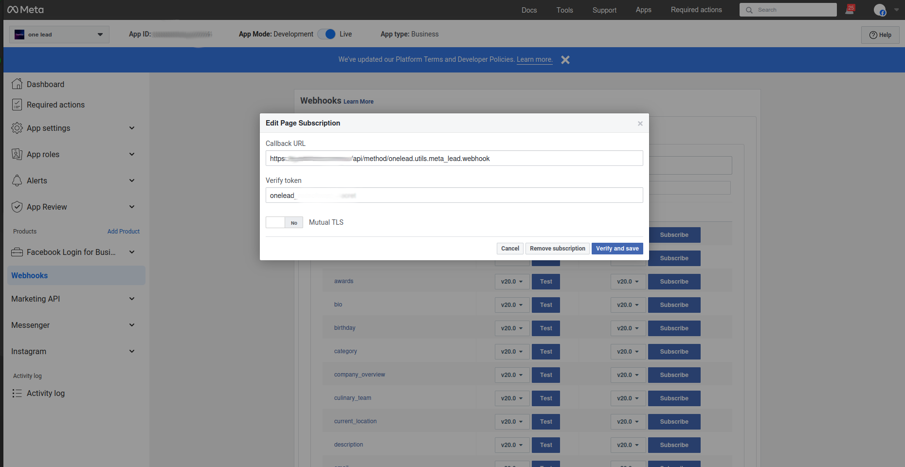
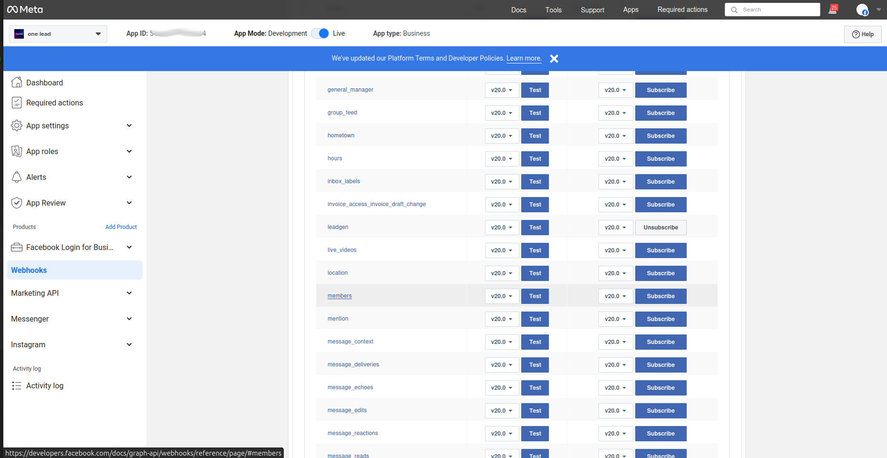

# Setting Up a Meta App for OneLead

To integrate OneLead with **Meta (Facebook) Lead Ads**, you need to create a **Meta App** in the **Facebook Developer Portal** and configure webhooks to receive lead data in real time.

This guide walks through **registering a Meta App**, **configuring permissions**, and **setting up the Meta Webhook Config in OneLead**.

---

## Create a Meta App

### Go to the Developer Portal
- Visit the [Facebook Developer Portal](https://developers.facebook.com/).
- Click **"My Apps"** → **"Create App"**.

### Select Business App Type
- Choose **Business** as the app type.
- Click **Next**.

### Set App Details
- Enter an **App Name** (e.g., `OneLead Integration`).
- Add a **Contact Email**.
- Select a **Business Account** (if applicable).
- Click **Create App**.

**Meta App Basic Settings:**


---

## Configure Basic Settings

### Add Products to Your App
- Under the **Dashboard**, go to **Add Products to Your App**.
- Select **Webhooks**.
- Click **Set Up**.

### Get Your App Credentials
- Navigate to **Settings > Basic**.
- Copy the **App ID** and **App Secret**.
- Add a **Privacy Policy URL** (required for public apps).
- Click **Save Changes**.

---

## Configure Webhooks in Meta

OneLead uses **webhooks** to receive lead data from Meta.

### Add a Webhook Endpoint
- Navigate to **Webhooks** in the **Meta App Dashboard**.
- Click **Add Callback URL**.
- Use the following webhook URL:
```plaintext
{your_frappe_url}/api/method/onelead.utils.meta_lead.webhook
```
- Example: `https://yourdomain.com/api/method/onelead.utils.meta_lead.webhook`
- Enter the **Webhook Verify Token** (set this in OneLead).
- Click **Verify and Save**.

**Adding Webhook URL in Meta App:**


### Subscribe to Webhook Events
- Under **Webhooks**, click **Subscribe to Events**.
- Enable the **leadgen** event.
- Click **Save Changes**.

**Subscribing to Leadgen Event:**


---

## Configure Meta Webhook in OneLead

Once the **Meta App is set up**, configure webhook settings in OneLead.

### Open Meta Webhook Config
- In Frappe, go to **OneLead > Settings > Meta Webhook Config**.
- Click **New** to create a new webhook configuration.

### Fill in Required Fields

| Field | Description |
|-------|------------|
| **Meta URL** | `https://graph.facebook.com` |
| **Meta API Version** | `v20.0` (or latest version) |
| **Webhook Verify Token** | Use the same token as in Meta Webhook settings |
| **App ID** | Your Meta App ID |
| **App Secret** | Your Meta App Secret |
| **App Name** | Name of your registered Meta App |
| **Is Enabled** | Enable to activate integration |
| **Page Flow** | Enable for automatic page and lead fetching |
| **User Access Token** | Generated from Meta Graph API Explorer (can be added after webhook verification) |

📌 **Note:** `Page Flow` **must be enabled**. In the future, this will be the only option available as `Campaign Flow` has been deprecated.

### Save and Verify
- Click **Save**.
- Click **Verify Webhook** to confirm the setup.

---

## Generate & Add User Access Token

Meta API requires a **User Access Token** with the necessary permissions.

### Open the Graph API Explorer
- Go to the [Meta Graph API Explorer](https://developers.facebook.com/tools/explorer/).
- Select your App.

### Grant Required Permissions

```plaintext
pages_show_list
ads_management
ads_read
leads_retrieval
pages_read_engagement
pages_manage_metadata
pages_manage_ads
```

### Generate the Token
- Click **Generate Access Token**.
- Copy the generated token.
- Paste it in **Meta Webhook Config > User Access Token** in OneLead.

---

## Connect Facebook in OneLead

Once the app is registered and webhook configured:
- Go to **Meta Webhook Config** in OneLead.
- Click **Connect Facebook**.
- If successful, OneLead will fetch **Ad Accounts and Pages**.

---

## Next Steps

- [Meta Form Mapping](meta_form_mapping.md)
- [Meta Webhook Lead Logs](meta_webhook_lead_logs.md)


---

## Troubleshooting

### Webhook Verification Fails
- Check the **Webhook URL** and **Verify Token** in the Meta App settings.
- Ensure that your **Frappe server is publicly accessible** (if running locally, use **ngrok** to expose it).

### Unable to Fetch Ad Accounts and Pages
- Ensure correct **API permissions** are granted to the **User Access Token**.
